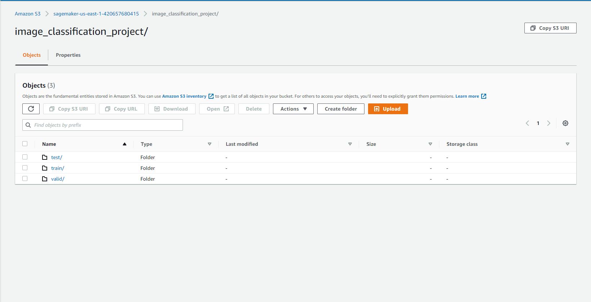
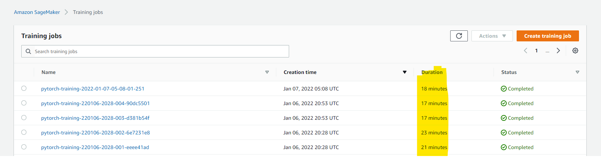
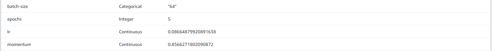
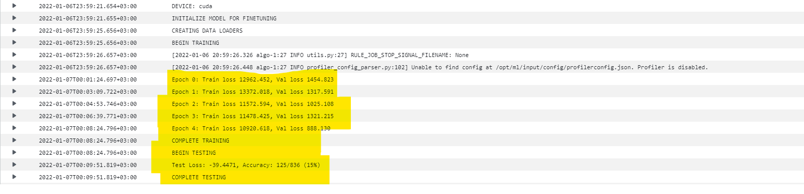
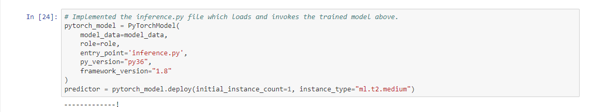
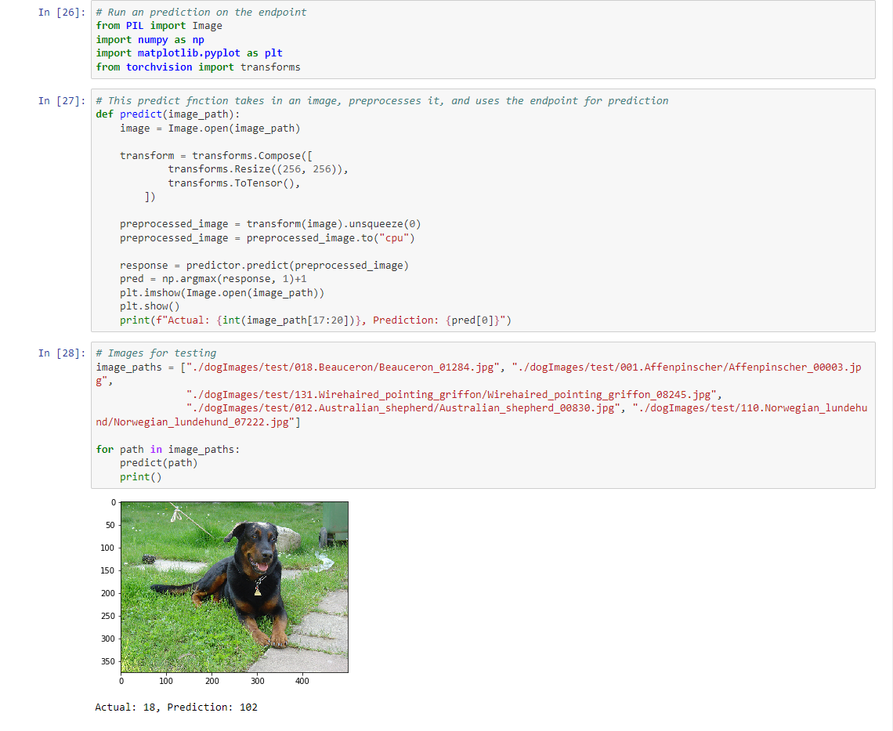

# Dog Breed Prediction using Trasnfer Learing on SageMaker

Use AWS Sagemaker to train a pretrained model that can perform image classification by using the Sagemaker profiling, debugger, hyperparameter tuning and other good ML engineering practices. This can be done on either the provided dog breed classication data set or one of your choice.

## Project Set Up and Installation
Enter AWS through the gateway in the course and open SageMaker Studio. 
Download the starter files.
Download/Make the dataset available. 

## Dataset
The provided dataset is the dogbreed classification dataset which can be found in the classroom.
The project is designed to be dataset independent so if there is a dataset that is more interesting or relevant to your work, you are welcome to use it to complete the project.

### Access
Upload the data to an S3 bucket through the AWS Gateway so that SageMaker has access to the data. 



## Hyperparameter Tuning
What kind of model did you choose for this experiment and why? Give an overview of the types of parameters and their ranges used for the hyperparameter search

The model selected for the final training was the ResNet50 as it was easier to finetune than the others. I also was small enough to be loaded without causing errors like VGG16 with was about 440MB.

The hyperparameters chosen were, batch size, lr, epochs, and momentum (This was more specufic to the SGD optimizer as I found that using Adam was very unstable). The ranges included:

- "lr": ContinuousParameter(0.01, 0.1),
- "batch-size": CategoricalParameter([32, 64]),
- "epochs": IntegerParameter(5, 10),
- "momentum": ContinuousParameter(0.5, 0.9),

All training jobs done are as shown below. This also includes the final model which is the most recent one:


The best hyperparameters from all your training jobs are as shown below:


The flow throughout the training job with be hyperparameters is as shown below:


## Debugging and Profiling
For this step I only did debugging and profiling for the actual training job instead of in hyperparameter tuning. The rules used were as shown below:

```
rules = [
    Rule.sagemaker(rule_configs.vanishing_gradient()),
    Rule.sagemaker(rule_configs.overfit()),
    Rule.sagemaker(rule_configs.overtraining()),
    Rule.sagemaker(rule_configs.poor_weight_initialization()),
    ProfilerRule.sagemaker(rule_configs.ProfilerReport()),
]

profiler_config = ProfilerConfig(
    system_monitor_interval_millis=500, framework_profile_params=FrameworkProfile(num_steps=10)
)

debugger_config = DebuggerHookConfig(
    hook_parameters={"train.save_interval": "100", "eval.save_interval": "10"}
)
```

And to plug these in to the estimator, I added the following:

```
rules=rules,
profiler_config=profiler_config,
debugger_hook_config=debugger_config
```

### Results
The insights I received form profiling were as follows:
- The batch size is too small, and GPUs are underutilized. Consider running on a smaller instance type or increasing the batch size.
- Choose a different distributed training strategy or a different distributed training framework.

More recommendations can be found in the profiler report.

## Model Deployment
The model was deployed using a separate script from the training script. In this solution you separate the deployment from the debugging, which is a better practice because the deployment is product phase and debugging is developing stage. To do this, you just create an inference script with at least model_fn in it and in your notebook, you do the following:
```
pytorch_model = PyTorchModel(model_data='s3://my-bucket/my-path/model.tar.gz', role=role, entry_point='inference.py')

predictor = pytorch_model.deploy(instance_type='...', initial_instance_count=...)
```

More details on this can be found in [PyTorch documentaion for SageMaker](https://sagemaker.readthedocs.io/en/stable/frameworks/pytorch/using_pytorch.html#load-a-model)



Endpoint invokations is as shown below:


